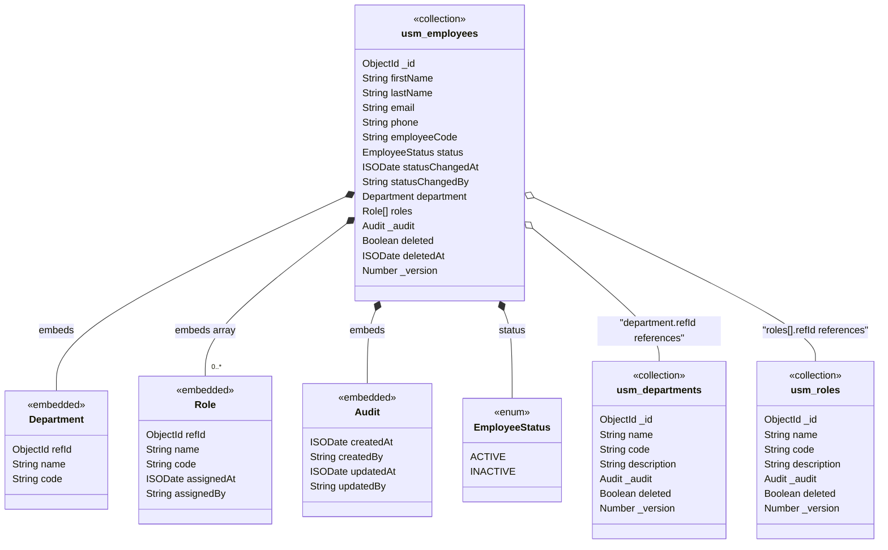

# NoSQL Document Design Reference

This reference contains the document-oriented design principles, embed-vs-reference
decision framework, and output format conventions used by the NoSQL Domain Model Extractor.

---

## Key Concepts: Document Model vs Relational Model

Document modeling inverts the relational mindset. Understanding these differences is essential
for producing correct output.

| Concern | Relational (RDBMS) | Document (NoSQL) |
|---------|--------------------|------------------|
| Design driver | Data structure and normalization | Access patterns and query shapes |
| Core unit | Table with rows | Collection with documents |
| Relationships | Foreign keys + JOINs | Embedding or referencing |
| 1:1 / 1:Few | Separate table with FK | Embed as nested object |
| 1:Many (bounded) | Separate table with FK | Embed as array within parent document |
| 1:Many (unbounded) | Separate table with FK | Separate collection with reference |
| Many:Many | Join table | Array of references on one or both sides, or bucket pattern |
| Normalization | 3NF default | Denormalize for read performance |
| Transactions | Cross-table transactions | Prefer single-document atomicity; cross-collection only when necessary |
| Schema | Strict, predefined | Flexible, but validation recommended |

---

## The Embed vs Reference Decision

This is the most critical design decision in document modeling. Every relationship must go
through this decision.

**Embed when:**
- The child data is always accessed with the parent (high read locality)
- The child has no independent lifecycle (cannot exist without the parent)
- The child cardinality is bounded and small (typically < 100 items)
- The child is rarely updated independently of the parent
- The combined document stays within size limits (typically < 16MB)
- You need atomic updates across parent and child

**Reference when:**
- The child has an independent lifecycle (created/queried/deleted on its own)
- The child is shared across multiple parents (many-to-many)
- The child cardinality is unbounded or very large
- The child is frequently updated independently
- The child data is large and would bloat the parent document
- You need to query the child collection independently

**Hybrid (denormalize + reference) when:**
- You reference a separate collection but embed a summary/snapshot of frequently-read
  fields to avoid cross-collection lookups for common queries

### Decision Flowchart

```
Is the child always accessed with the parent?
├── YES
│   Is the cardinality bounded and small (< 100)?
│   ├── YES
│   │   Is the child updated independently and frequently?
│   │   ├── YES → REFERENCE (separate collection)
│   │   └── NO  → EMBED (nested document or array)
│   └── NO  → REFERENCE (unbounded cardinality)
└── NO
    Does the child have an independent lifecycle?
    ├── YES → REFERENCE (separate collection)
    └── NO
        Is the child shared across multiple parents?
        ├── YES → REFERENCE (with optional denormalized summary)
        └── NO  → EMBED
```

---

## DDD to Document Model Classification

| DDD Classification | Document Model Mapping |
|--------------------|----------------------|
| Aggregate Root | **Root Collection** — becomes its own collection. This is the primary document. |
| Entity (within aggregate) | **Embedded Document** — nested inside the aggregate root's document. Only promote to a separate collection if it has an independent lifecycle or unbounded cardinality. |
| Value Object | **Embedded Object** — always embedded, never a separate collection. |
| Enum / Type | **Enum field** — stored as a string field with documented allowed values. |
| Join Entity (M:N) | **Array of references** — stored as an array of IDs on one or both sides. Only create a separate collection if the join carries significant data (> 3 fields beyond the two FKs). |
| Domain Event | **Event document** — may warrant its own collection if event sourcing is needed. |

**Key rule:** Start by embedding everything inside the aggregate root. Then selectively
promote to separate collections only when one of the "Reference when" criteria is met.

---

## Access Pattern Analysis Matrix

For each collection candidate, determine:

| Analysis | Question | Impact |
|----------|----------|--------|
| **Read pattern** | Is this data always read together with its parent? | If yes → embed |
| **Write pattern** | Is this data updated independently of its parent? | If yes → reference |
| **Cardinality** | How many child items per parent? | Bounded & small → embed; unbounded → reference |
| **Size** | How large is each child document? | Large → reference to avoid bloating parent |
| **Query independence** | Do you need to query this data without knowing the parent? | If yes → reference |
| **Sharing** | Is this data referenced by multiple parents? | If yes → reference |
| **Update frequency** | How often does the child change relative to the parent? | High independent change → reference |

---

## Document-Specific Field Conventions

| Convention | RDBMS Equivalent | Document Model |
|------------|------------------|----------------|
| Primary key | `id` (UUID) | `_id` (ObjectId or UUID, depending on platform) |
| Foreign key | `department_id` (FK) | `departmentId` (reference) or embedded `department: { ... }` |
| Audit fields | Per-table columns | Embedded `_audit: { createdAt, createdBy, updatedAt, updatedBy }` or top-level fields |
| Soft delete | `deleted`, `deletedAt`, `deletedBy` | Same fields, top-level in document |
| Versioning | `version` (Long) | `_version` (Number) for optimistic concurrency |
| Timestamps | `Instant` | `ISODate` (ISO 8601 string) |

---

## NFR Adaptation for Document Model

| NFR | RDBMS Impact | Document Model Impact |
|-----|-------------|----------------------|
| Audit Trail | Audit log table | Embedded `_audit` object or separate audit collection (if queried independently) |
| Soft Delete | `deleted` column | `deleted`, `deletedAt`, `deletedBy` top-level fields |
| Multi-Tenancy | `tenantId` column + RLS | `tenantId` top-level field + collection-level or document-level access control |
| Optimistic Locking | `version` column | `_version` field |
| Full-Text Search | Indexed columns | Text indexes or dedicated search fields; consider search-specific denormalization |

---

## Output Format Conventions

### Mermaid Class Diagram Conventions

- Each root collection is a class with stereotype `<<collection>>`
- Each embedded document is a class with stereotype `<<embedded>>`
- Each enum is a class with stereotype `<<enum>>`
- Composition arrows (`*--`) indicate embedding (child lives inside parent document)
- Association arrows (`o--`) indicate referencing (separate collection, linked by ID)
- Array relationships use `"1..*"` or `"0..*"` multiplicity notation
- Collection names use `lower_snake_case` **with 3-character module prefix** (e.g., `usm_employees`)
- Embedded document names use `PascalCase` (no prefix, since they're not standalone collections)
- Field names use `camelCase`

### Mermaid Diagram Example



### JSON Schema Example Format

```json
{
  "_meta": {
    "module": "Module Name",
    "prefix": "XXX",
    "versions": ["1.0", "1.1"],
    "generatedBy": "modelgen-nosql"
  },
  "collections": {
    "xxx_collection_name": {
      "description": "Purpose of the collection",
      "exampleDocument": {
        "_id": "ObjectId('...')",
        "field": "value"
      },
      "indexes": [
        { "field": "fieldName", "type": "unique" }
      ]
    }
  }
}
```

Each collection entry must include:
- `description` — purpose of the collection
- `exampleDocument` — full document with realistic sample values showing all fields,
  embedded documents, and arrays
- `indexes` — recommended indexes derived from access patterns and query needs

Index type values: `unique`, `single`, `compound`, `text`, `ttl`
