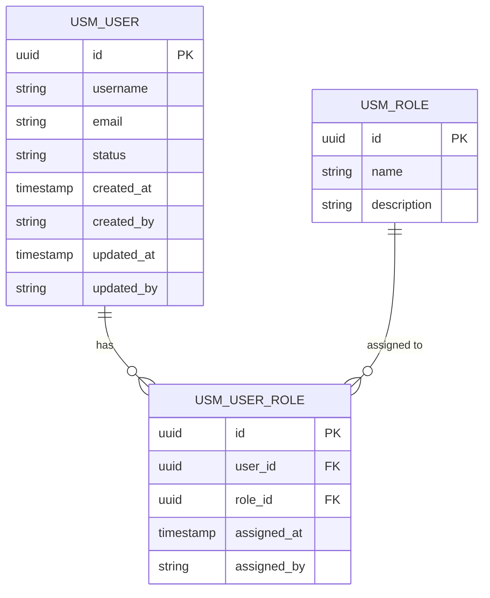

# Relational Model Generator

Extract structured module models from Agile user stories following a systematic DDD methodology.

## When to Use

Trigger this skill when the user asks to:
- Extract a module model, data model, or entity model
- Generate an ERD or entity-relationship diagram from user stories
- Design database tables or schema from requirements
- Perform DDD analysis on user stories
- Update an existing module model based on story changes
- Upgrade the model to a new version
- Detect and fix outdated/invalid model elements

## Version Gate

Before starting any work, resolve the application folder first (see Input Resolution below), then check `CHANGELOG.md` in the application folder (`<app_folder>/CHANGELOG.md`):

1. If `<app_folder>/CHANGELOG.md` does not exist, skip this check (first-ever execution for this application).
2. If `<app_folder>/CHANGELOG.md` exists, scan all `## vX.Y.Z` headings and determine the **highest version** using semantic versioning comparison.
3. Compare the requested version against the highest version:
   - If requested version **>=** highest version: proceed normally.
   - If requested version **<** highest version: **STOP immediately**. Print: `"Version {requested} is lower than the current application version {highest} recorded in <app_folder>/CHANGELOG.md. Execution rejected."` Do NOT proceed with any work.

## Input Resolution

The skill requires mandatory `<application>` and `<version>` arguments, with an optional `module:` argument.

### Argument Syntax

| Argument | Required | Description |
|----------|----------|-------------|
| `<application>` | Yes | Application name — matched against root-level application folders |
| `<version>` | Yes | Version label (e.g., `v1.0.3`). Used for version-filtered generation. |
| `module:<name>` | No | Limit generation to a single module |

| Format | Example | Meaning |
|--------|---------|---------|
| App + version | `/modelgen-relational hub_middleware v1.0.3` | All modules, version-filtered |
| App + version + module | `/modelgen-relational hub_middleware v1.0.3 module:Location Information` | Single module, version-filtered |
| Module quoted | `module:"Location Information"` | Quoted form (equivalent) |
| Module snake_case | `module:location_information` | Converted to title-case for matching |

### Application Folder Resolution

1. List root-level application folders that have a numeric prefix (e.g., `1_hub_middleware`, `2_hc_adapter`)
2. Strip the leading `<number>_` prefix from each folder name (e.g., `1_hub_middleware` -> `hub_middleware`)
3. Match the provided application name **case-insensitively** against the stripped folder names
4. Accept `snake_case`, `kebab-case`, or title-case input (e.g., `hub_middleware`, `hub-middleware`, `Hub Middleware` all match `1_hub_middleware`)
5. If no match is found, list all available application names and **stop**

### Auto-Resolved Paths

| File | Resolved Path |
|------|---------------|
| PRD.md | `<matched_app_folder>/context/PRD.md` |
| Output directory | `<matched_app_folder>/context/model/` |

### Module Matching Rules

1. Match the specified module name **case-insensitively** against modules in PRD.md
2. Convert `snake_case` input to title-case for matching (e.g., `location_information` -> `Location Information`)
3. If no module matches, **stop and report available module names** before doing any file writes
4. Exactly one module must match — partial or ambiguous matches are rejected with suggestions

### Version Filtering

When a version argument is provided:

1. Only process user stories from versions **up to and including** the specified version
2. Stories from later versions are excluded from extraction
3. Version comparison uses the ordering present in PRD.md (versions appear in document order, earlier = lower)
4. The generated model reflects the state of the system at the specified version

When combined with `module:`, both filters apply: only stories in the target module at or below the target version are processed.

---

## Update Mode

This section defines the **incremental update** workflow for evolving an existing module model
when user stories change across versions. Use this mode instead of full regeneration when working
with a previously generated model.

### Update Mode Triggers

Activate update mode when the user says:
- "update the model"
- "upgrade the model"

The user must provide a **new version identifier** for the update (e.g., "1.1.0", "v2", "Sprint-4").

### Update Mode Input Contract

| Element | Description |
|---------|-------------|
| **Existing Model Directory** | Path to previously generated output (must contain MODEL.md + module subdirectories with model.md and erd.mermaid) |
| **Updated PRD.md** | The updated user story file with changes (additions, modifications, removals) |
| **New Version** | Version label for this update (e.g., "1.1.0", "v2") |

### Update Mode Processing Workflow

#### Phase U1: Baseline Loading

- Read all existing model files (MODEL.md, per-module model.md, erd.mermaid)
- Build an inventory of current entities, attributes, relationships, enums with their source story traceability tags

#### Phase U2: Change Detection (Diff Analysis)

- Parse the updated PRD.md
- Compare against source story references in existing model files
- Classify changes into:
  - **ADDED** — New stories not referenced by any existing model element
  - **MODIFIED** — Stories whose text has changed (same tag, different content)
  - **REMOVED** — Stories referenced in the model but no longer present in PRD.md
  - **UNCHANGED** — Stories with no changes

#### Phase U3: Staleness & Validity Check

For each existing model element (entity, attribute, relationship, enum value), check:
- **Orphaned elements**: Source stories entirely removed → flag for removal
- **Partially orphaned**: Some source stories removed but others remain → flag for review
- **Stale attributes**: Source story text changed such that the attribute inference no longer holds → flag for update
- **Stale relationships**: Verb/preposition patterns changed → flag for re-evaluation
- **Stale enums**: Qualifier terms changed or removed → flag for update
- **Contradictions**: New stories contradict existing model assumptions → flag

Produce a **Staleness Report** table:

| Element Type | Element Name | Module | Status | Reason | Affected Stories | Action |
|---|---|---|---|---|---|---|
| Entity | Order | Order Mgmt | ORPHANED | All source stories removed | [US-010] | REMOVE |
| Attribute | priority | Order | STALE | Source story US-005 modified | [US-005] | UPDATE |

Status values: `ORPHANED`, `STALE`, `CONTRADICTED`, `VALID`
Action values: `REMOVE`, `UPDATE`, `REVIEW`, `KEEP`

#### Phase U4: Incremental Extraction

- For ADDED stories: run the full 8-phase extraction pipeline (existing Phases 1–8)
- For MODIFIED stories: re-extract affected model elements, compare with existing, merge
- Apply new version tag to all new/modified elements

#### Phase U5: Model Merge

- Integrate new/updated elements into existing model
- Remove ORPHANED elements (after confirmation or auto-removal if clearly orphaned)
- Update version annotations on modified elements
- Preserve unchanged elements with their original versions

#### Phase U6: Output Regeneration

- Regenerate all output files (erd.mermaid, model.md, MODEL.md) with merged model
- Add a **Changelog** section to each module's model.md and to the root MODEL.md

---

## Methodology Reference

Before processing any input, read the full extraction methodology:

```
Read references/model-extraction-methodology.md
```

This reference defines the 8-phase extraction pipeline in detail, including linguistic
analysis heuristics, entity classification decision trees, attribute inference rules,
relationship detection patterns, and NFR impact mappings. The instructions below
orchestrate that methodology — always defer to the reference for phase-specific rules.

---

## Input Contract

The user MUST provide the following structured input. If any required element is missing,
ask the user to supply it before proceeding. Do NOT infer modules from story content.

### Required Input

| Element | Description |
|---------|-------------|
| **Module List** | Explicit list of module names (bounded context candidates) |
| **User Stories** | Agile-format stories, each tagged with a **module** and a **version**. Format: "As [role], I want to [action] [object] so that [purpose]". The module associates the story to a bounded context. The version enables progressive model evolution tracking — every entity, attribute, relationship, and enum value in the output will reference the version that introduced it. |
| **NFRs per Module** | Non-functional requirements (security, performance, compliance, etc.) |

### Optional Input

| Element | Description |
|---------|-------------|
| **Module Prefix Overrides** | A 3-character prefix per module to override the auto-generated one. Format: `Module Name: XXX`. If not provided, the skill generates a prefix automatically (see Prefix Generation Rules). |
| **Assumptions** | Assumptions the user has made about the domain or requirements |
| **Constraints** | Technical or business constraints affecting the model |
| **Glossary** | Domain-specific term definitions (ubiquitous language) |
| **Existing Data Model** | Current-state model for migration or extension scenarios |

### Input Format Example

```markdown
## Module: User Management

### Version: 1.0

- US-001: As an Admin, I want to create user accounts so that new employees can access the system.
- US-002: As an Admin, I want to assign roles to users so that access is controlled.

### Version: 1.1

- US-010: As an Admin, I want to deactivate user accounts so that former employees lose access.
- US-011: As a User, I want to update my profile so that my contact information stays current.

#### NFRs
- NFR-001: All entities must support soft delete.
- NFR-002: Audit trail required for all write operations.

#### Assumptions
- User accounts are internal only (no external/public registration).
```

The version tag is freeform (e.g., `1.0`, `v2`, `Sprint-3`, `Phase-1`). The skill does not
enforce a versioning scheme but preserves the user's version labels exactly as provided.

### Module Prefix Generation Rules

Each module is assigned a 3-character uppercase prefix used in ERD entity names to support
shared-database deployment. The prefix is auto-generated but can be overridden by the user.

**Auto-generation algorithm (in order of preference):**

1. **Multi-word module** — take the first letter of each word, up to 3 characters.
  - "User Management" → `USM`
  - "Order Processing" → `ORP`
  - "Inventory" → `INV` (single word: first 3 characters)
2. **Single-word module** — take the first 3 characters.
  - "Billing" → `BIL`
  - "Inventory" → `INV`
3. **Collision resolution** — if two modules produce the same prefix, append a numeric
   suffix to the second one and truncate to 3 characters.
  - "Order Processing" → `ORP`, "Order Placement" → `OPL` (use first + second-word first two)
  - If still colliding, use first letter + incremental digit: `OR1`, `OR2`

**Rules:**
- Prefix is always exactly 3 characters, uppercase A-Z or A-Z + digit for collision cases.
- The prefix is applied **only in ERD entity names** (e.g., `USM_USER`, `ORP_ORDER`).
  It does NOT appear in the `model.md` tables, where entities use their clean PascalCase
  names for readability.
- Present the prefix-to-module mapping at the top of each `erd.mermaid` file as a comment
  and in a **Module Prefix Map** section in `model.md`.

**Override:** The user can supply prefix overrides in the input. Overrides must be exactly
3 uppercase characters and take priority over auto-generation.

### Input Validation Rules

1. **Requirement tagging is mandatory.** Before processing, scan the input PRD.md file and verify that ALL top-level bullet items under User Story, Functional Requirements, Non Functional Requirement, Constraint, and Reference sections have a tag code (e.g., `[USHM00003]`, `[NFRHM0003]`, `[CONSHM003]`, `[REFHM0003]`). If ANY item is missing a tag, **stop immediately** and invoke the `util-ustagger` skill on the file to tag all untagged items. Only resume model extraction after all items are tagged. These tag codes will be used as the `Source Story` reference throughout the model output.
2. **Module-story binding is mandatory.** Every user story must be explicitly tagged with a module. If stories are provided without module assignment, stop and ask the user to assign them.
3. **Version tag is mandatory.** Every user story must be associated with a version. If stories are provided without version tags, stop and ask the user to assign them.
4. **Story format check.** Each story should follow "As [role], I want to [action] [object] so that [purpose]". Flag stories that deviate and ask for clarification, but attempt to parse them.
5. **At least one NFR per module.** If no NFRs are provided for a module, prompt the user to confirm whether standard conventions (audit trail, soft delete, optimistic locking) should apply as defaults.
6. **Output directory is auto-resolved.** The output directory is automatically resolved to `<matched_app_folder>/context/model/`. Auto-create if the path doesn't exist (including any intermediate parent directories).

---

## Processing Workflow

Process ALL modules in a single pass. Each module is treated as an independent bounded
context — do not model cross-module relationships. If you detect a potential cross-module
dependency (e.g., Module A references an entity that looks like it belongs to Module B),
note it in the assumptions table but do not create a relationship.

### Version Tracking

Within each module, process user stories **in version order** (earliest version first).
Every model element — entity, attribute, relationship, enum value, domain event — must
be annotated with the **version that introduced it**. This means:

- If Entity `Order` first appears from stories in version `1.0`, its version is `1.0`.
- If a new attribute `priority` is added to `Order` by a story in version `1.1`, that
  attribute's version is `1.1`, while the entity's version remains `1.0`.
- If an existing enum gains new values in a later version, the new values carry the
  later version while existing values retain their original version.

This enables the user to trace exactly what changed at each version and supports
progressive model growth across sprints or phases.

For each module, execute the following phases sequentially. The output is the final
consolidated result — do NOT include intermediate phase analysis in the deliverables.

### Phase 1: Linguistic Analysis

Parse each user story using the grammar-to-domain mapping from the methodology reference
(Section 3). For compound stories with multiple verbs, decompose into individual operations.

Key extractions:
- **Subjects** → Actor/Role candidates (enum values)
- **Verbs** → Operations, commands, state transitions
- **Direct Objects** → Primary entity candidates
- **Indirect Objects** → Related entity candidates
- **Purpose Clauses** → Business rules, domain events
- **Adjectives/Qualifiers** → Enum values, states, types

### Phase 2: Entity Identification

Classify every extracted noun using the decision flowchart from the methodology reference
(Section 4.2):

```
Finite known set? → ENUM
Has identity + lifecycle? → Is it aggregate root? → AGGREGATE ROOT / ENTITY
Immutable, describes another? → VALUE OBJECT
Verb/action that happened? → DOMAIN EVENT
Otherwise → DOMAIN SERVICE or needs analysis
```

Apply naming conventions: PascalCase for entities, enums, events, value objects, join entities.

### Phase 3: Attribute Extraction

Derive attributes from four sources in priority order:
1. **Explicit mention** in user story text
2. **Operation inference** (CRUD verbs → audit fields, version, soft delete)
3. **NFR requirements** (see Appendix B of the methodology reference)
4. **Domain convention** (id, audit fields, base entity pattern)

For each attribute, determine: name (camelCase), type, nullable, constraints, and source type
(`EXPLICIT`, `OPERATION_INFERENCE`, `NFR`, `CONVENTION`, or `ASSUMPTION`).

#### Primary Key Convention

All entity primary keys MUST use **UUID** type with **database-level generation**. The UUID value MUST be generated by the database engine itself (e.g., `gen_random_uuid()` in PostgreSQL, `UUID()` in MySQL, `NEWSEQUENTIALID()` in SQL Server), NOT by the application layer. This is a mandatory convention for all entities including join entities.

**Rationale:** Application-generated UUIDs introduce performance overhead (extra network round-trips, inconsistent generation strategies across application instances, potential index fragmentation from random UUIDs). Database-generated UUIDs ensure consistent generation, reduce application complexity, and allow the database to use optimized UUID variants (e.g., UUIDv7 or sequential UUIDs) for better index performance.

In model documentation, annotate the `id` attribute with `DB-generated UUID` in the Constraints column to make this explicit.

When a story is ambiguous, propose defaults and record the ambiguity.

### Phase 4: Relationship Mapping

Detect relationships using the verb/preposition patterns from the methodology reference
(Section 6.1). For each relationship, determine:
- Source and target entities
- Cardinality (1:1, 1:N, N:1, M:N)
- Join entity name (for M:N)
- Cascade behavior
- Source story traceability

Promote M:N relationships to join entities with audit fields.

### Phase 5: Cross-Cutting Concerns

Scan NFRs and map each to model impact using the NFR-to-Model Impact Map (Appendix B
of the methodology reference). Define a base entity specification if audit fields, soft
delete, or optimistic locking are implied.

#### Phase 5a: Architecture Principle Integration

If PRD.md contains an `# Architecture Principle` section, read it and apply to model decisions:

- **Monolithic vs. Microservice**: If "monolithic" (e.g., "monolithic web application", "modular architecture"), model cross-module references as soft references (ID columns without FK constraints) and note this convention in the Cross-Module Dependencies section. If "microservice", enforce strict bounded context isolation — no cross-module references at all.
- **Event-driven**: If architecture mentions "event-driven" or "domain events", elevate domain event identification in Phase 2. Generate more domain event entities and event payload types in Section 7 (Domain Events). Each inter-module data flow should have a corresponding domain event.
- **Stateless**: If architecture mentions "stateless", confirm that no session-related entities are modeled — user context comes from JWT tokens or external identity providers.
- **Database type confirmation**: Use the architecture section to confirm the relational database choice. If the architecture mentions a specific database engine (e.g., PostgreSQL, MySQL), record it in assumptions for DDL dialect considerations.

If the `# Architecture Principle` section is absent, skip this sub-phase and proceed with existing behavior.

#### Phase 5b: Process Flow State Extraction

If PRD.md contains a `# High Level Process Flow` section, read it and extract state-related information:

- **Entity lifecycle states**: If a process flow describes status transitions for an entity (e.g., "Received → Validated → Enriched → Active"), cross-reference with enum extraction from Phase 2. Ensure all states mentioned in process flows appear in the corresponding entity's status enum definition. Add any missing states.
- **Intermediate entities**: If a flow describes intermediate or staging data (e.g., "incoming message stored before validation"), verify that corresponding staging/intermediate entities exist in the model. If not, create them.
- **Domain events from flows**: Each step in a process flow that describes "publishes", "sends", or "triggers" should be checked against the Domain Events table (Section 7). Add any flow-derived events not already captured from user stories.

If the `# High Level Process Flow` section is absent, skip this sub-phase.

### Phase 6: Bounded Context Finalization

Since modules are provided explicitly by the user, confirm each module as a bounded context.
Within each context, identify aggregates by grouping entities with transactional cohesion.
No aggregate should contain more than 4–5 entities.

### Phase 7: Output Generation

Produce the two deliverables per module (see Output Specification below).

### Phase 8: Validation

Run the completeness and quality checklists from the methodology reference (Section 10)
as a self-review. Fix any issues found before presenting the output.

---

## Changelog Append

After all model files are successfully generated, append an entry to `CHANGELOG.md` in the application folder (`<app_folder>/CHANGELOG.md`):

1. Read `<app_folder>/CHANGELOG.md`. If it does not exist, create it with:
   ```markdown
   # Changelog

   - This file tracks all skill executions by version for this application.
   - The highest version recorded here is the current application version.
   - Skills MUST NOT execute for a version lower than the highest version in this file.

   ---
   ```
2. Search for a `## {version}` heading matching the current version.
3. If the section **exists**: append a new row to its table.
4. If the section **does not exist**: insert a new section after the `---` below the context header and before any existing `## vX.Y.Z` section (newest-first ordering), with a new table header and the first row.
5. Row format: `| {YYYY-MM-DD} | {application_name} | modelgen-relational | {module or "All"} | Generated relational module models |`
6. **Never modify or delete existing rows.**

## Output Specification

For each module, produce exactly **two files** plus one **root-level summary file**:

### 1. ERD Mermaid File: `{module-dir}/erd.mermaid`

A valid Mermaid ER diagram file. Requirements:

- Use the `erDiagram` diagram type
- Include ALL entities from the entity catalog for this module
- Show all attributes with data types for each entity
- Mark PK and FK fields
- Show all relationships with cardinality using Mermaid notation:

| Marker | Meaning |
|--------|---------|
| `\|\|` | Exactly one |
| `o\|` | Zero or one |
| `\|{` | One or more |
| `o{` | Zero or more |

- Use descriptive relationship labels (verbs from the stories)
- Entity names in UPPER_SNAKE_CASE **with 3-character module prefix** (e.g., `USM_USER`, `USM_ROLE`)
- Attribute names in snake_case in the diagram
- Mermaid ERD does not natively support version annotations. The ERD represents the
  **cumulative model across all versions**. Per-element version tracking is captured
  in the companion `model.md` file. Add a Mermaid comment at the top of the file
  listing the versions included and the module prefix mapping.

Example structure:


### 2. Model Documentation: `{domain-dir}/model.md`

A markdown file containing the following sections. Use tables for all structured data.

#### Document Structure

```markdown
# Module Model: {Module Name}

## 1. Module Prefix Map

| Module | Prefix | Auto-Generated | Override |
|--------|--------|----------------|----------|

(e.g., User Management | USM | Yes | — )

## 2. Entity Catalog

| Entity | DDD Type | Bounded Context | Key Attributes | Relationships | Source Stories | Version |
|--------|----------|-----------------|----------------|---------------|---------------|---------|

## 3. Base Entity Specification
(If applicable — audit fields, soft delete, versioning inherited by all entities)

## 4. Attribute Detail
(One subsection per entity with full attribute table)

### 4.x {Entity Name}

| Attribute | Type | Nullable | Constraints | Source | Source Story | Version |
|-----------|------|----------|-------------|--------|--------------|---------|

## 5. Relationship Catalog

| Source Entity | Target Entity | Cardinality | Join Entity | Cascade | Business Rule | Source Story | Version |
|---------------|---------------|-------------|-------------|---------|---------------|-------------|---------|

## 6. Enum Definitions
(One subsection per enum)

### 6.x {Enum Name}

| Value | Description | Source Story | Version |
|-------|-------------|--------------|---------|

## 7. Domain Events

| Event Name | Trigger Story | Aggregate | Payload Fields | Version |
|------------|---------------|-----------|----------------|---------|

## 8. Bounded Context Summary

| Context | Aggregates | Description |
|---------|------------|-------------|

## 9. Assumptions and Ambiguities

| Story ID | Entity / Attribute | Assumption Made | Clarification Needed | Version |
|----------|--------------------|-----------------|----------------------|---------|

## 10. Changelog

### Version {new-version} (from {previous-version})

#### Added
| Element Type | Name | Description | Source Stories |
|---|---|---|---|

#### Modified
| Element Type | Name | Change Description | Previous | New | Source Stories |
|---|---|---|---|---|---|

#### Removed
| Element Type | Name | Reason | Former Source Stories |
|---|---|---|---|

#### Flagged for Review
| Element Type | Name | Issue | Recommendation |
|---|---|---|---|
```

### 3. Root Summary: `MODEL.md`

After generating all per-module files, produce a single `MODEL.md` in the **root output directory**.
This file serves as the entry point and table of contents for the entire model extraction output.

#### Document Structure

```markdown
# Module Model Summary

> Generated from {total story count} user stories across {module count} modules.

## Modules

| # | Module | Prefix | Entities | Relationships | Versions | Stories |
|---|--------|--------|----------|---------------|----------|---------|

(One row per module. Entities = count of entities in that module. Relationships = count of
relationships. Versions = comma-separated list of versions included. Stories = count of
source stories for that module.)

## Table of Contents

### {Module Name} (`{prefix}`)

> {One-line summary: e.g., "Manages user accounts, roles, and permissions."}

- **Model Documentation:** [{module-kebab}/model.md](./{module-kebab}/model.md)
- **ERD Diagram:** [{module-kebab}/erd.mermaid](./{module-kebab}/erd.mermaid)
- **Entities:** {comma-separated PascalCase entity names}
- **Key Relationships:** {2–3 most significant relationships in natural language}

(Repeat for each module, in the same order as the Modules table.)

## Cross-Module Dependencies

| Source Module | Target Module | Dependency | Noted In |
|---------------|---------------|------------|----------|

(List any cross-module dependencies flagged in assumptions tables. If none, state "No
cross-module dependencies were identified.")

## Assumptions Summary

| Module | Count | Critical |
|--------|-------|----------|

(Count = total assumptions for that module. Critical = count of assumptions marked as
needing clarification. Links to the respective module's Assumptions and Ambiguities section.)

## Update History

| Version | Date | Modules Affected | Added | Modified | Removed | Flagged |
|---|---|---|---|---|---|---|
```

---

## Constraints

1. **No module inference.** The skill does not guess which module a story belongs to.
   Module-to-story mapping must be provided by the user.
2. **Modules are independent.** Do not create relationships between entities in different
   modules. Flag potential cross-module dependencies in the assumptions table.
3. **Concise output.** Produce only the final consolidated tables. Do not include
   intermediate linguistic analysis, noun classification lists, or phase-by-phase
   working notes in the deliverables.
4. **Traceability.** Every entity, attribute, and relationship in the output must
   reference its originating user story ID or NFR.
5. **Ambiguity transparency.** When making assumptions, always record them in the
   Assumptions and Ambiguities table with a clarification question.

---

## File Naming Convention

All output files are written under the user-specified output directory, organized as
one subdirectory per module. Module names are converted to kebab-case for directory names.

Given an output directory `/path/to/output` and three modules — "User Management",
"Order Management", and "Inventory":

```
/path/to/output/
├── MODEL.md                  # Root summary and table of contents
├── user-management/
│   ├── erd.mermaid
│   └── model.md
├── order-management/
│   ├── erd.mermaid
│   └── model.md
└── inventory/
    ├── erd.mermaid
    └── model.md
```

The root directory contains:
- `MODEL.md` — summary and table of contents linking to all module models

Each subdirectory contains exactly two files:
- `erd.mermaid` — the Mermaid ERD diagram for that module
- `model.md` — the full model documentation for that module

---

## Quality Gates (Self-Review)

Before presenting output, verify:

- [ ] Every user story has at least one corresponding entity
- [ ] Every entity has at least one source user story
- [ ] Every entity has an `id` field (UUID, DB-generated) and audit fields (or inherits from base entity)
- [ ] All primary keys use UUID type with database-level generation (not application-generated)
- [ ] Every state-change verb has a corresponding enum with transition rules
- [ ] Every "assign X to Y" pattern has a join entity
- [ ] Every NFR has been analyzed for model impact
- [ ] All M:N relationships have join entities
- [ ] No aggregate exceeds 4–5 entities
- [ ] No entity exceeds 15–20 attributes (decompose into value objects if larger)
- [ ] Naming conventions are consistent (PascalCase entities, camelCase attributes)
- [ ] The Mermaid ERD is syntactically valid
- [ ] All ambiguities are recorded with proposed defaults
- [ ] Root `MODEL.md` is generated with correct links to all module subdirectories
- [ ] `MODEL.md` module statistics (entity count, relationship count, story count) match actual output

### Update Mode Quality Gates

When running in update mode, additionally verify:

- [ ] All removed stories have their model elements addressed (removed or re-sourced)
- [ ] All modified stories have their model elements re-evaluated
- [ ] No orphaned elements remain without explicit KEEP justification
- [ ] Changelog accurately reflects all changes
- [ ] Version annotations are correct (new elements get new version, unchanged keep original)
- [ ] MODEL.md Update History is current
