# Util Project Sync

Synchronize project folder structure, PRD.md, and BUG.md files to match the canonical structure defined in CLAUDE.md. Validates dependencies before syncing.

## Input Resolution

This skill requires no arguments. All configuration is read from CLAUDE.md in the project root.

### Required Sections in CLAUDE.md

| Section | Purpose |
|---------|---------|
| `# Custom Applications` | List of custom applications to create folders for and validate |
| `# Supporting 3rd Party Applications` | List of 3rd party applications referenced as dependencies |
| `## External Services` | External services (SMTP, Push Notifications, AI, WAF, etc.) referenced as dependencies |
| `# Modules` | Module definitions grouped under `## System Module` and `## Business Module` |

### Application Detection

1. Read the `# Custom Applications` section in CLAUDE.md
2. Each application is listed as a `## <Application Name>` heading under the section
3. If the section contains `**No Custom Applications**` or similar "none" indicator, report that there are no applications to sync and **stop**

### 3rd Party Application Detection

1. Read the `# Supporting 3rd Party Applications` section in CLAUDE.md
2. Each 3rd party application is listed as a `## <Application Name>` heading under the section
3. If the section contains `**No Supporting 3rd Party Applications**` or similar "none" indicator, treat as having zero 3rd party applications

### External Services Detection

1. Read the `## External Services` sub-section in CLAUDE.md (typically located under `# Supporting 3rd Party Applications` or as a standalone section)
2. Each external service is listed as a `## <Service Name>` heading under the section
3. Extract the service name from each heading
4. If the section does not exist or contains no services, treat as having zero external services

### Module Detection

1. Read the `# Modules` section in CLAUDE.md
2. Modules are organized under `## System Module` and `## Business Module` subsections
3. Each module is listed as a `### <Module Name>` heading under its parent section
4. If a module section contains `**There is no System Module**` or `**There is no Business Module**` or similar "none" indicator, treat that category as having zero modules

## Workflow

### 1. Parse CLAUDE.md

Read CLAUDE.md from the project root and extract:
- **Custom Application list**: names and their full content (description, dependencies) from `## <Name>` headings under `# Custom Applications`
- **3rd Party Application list**: names and their full content from `## <Name>` headings under `# Supporting 3rd Party Applications`
- **External Services list**: names from `## <Name>` headings under `## External Services`
- **All dependency target names**: combined list of custom application names, 3rd party application names, and external service names (used as the valid dependency pool)
- **System Modules**: names from `### <Name>` headings under `## System Module`
- **Business Modules**: names from `### <Name>` headings under `## Business Module`

### 2. Validate Dependencies

Run all validation checks across `# Custom Applications`, `# Supporting 3rd Party Applications`, and `## External Services`. Collect all issues found. After all checks are complete, insert `[TODO]` annotations into CLAUDE.md for each issue.

#### 2a. Dependency Validation

For each application (custom and 3rd party) that has a `- Depends on:` section, extract its dependency list. Each dependency is a bullet item under "Depends on:" — the dependency name is the text before any parenthetical qualifier or "for"/"to"/"when" clause.

**Check 1: No Circular Dependencies**

Build a directed dependency graph from all applications. Detect cycles using depth-first traversal. A circular dependency exists when application A depends on B, and B depends (directly or transitively) on A.

Example of a circular dependency:
- Hub Middleware depends on HC Adapter Message Queue
- HC Adapter Message Queue depends on Hub Single Sign On
- Hub Single Sign On depends on Hub Middleware (cycle!)

For each cycle found, record the full cycle path (e.g., `Hub Middleware -> HC Adapter Message Queue -> Hub Single Sign On -> Hub Middleware`).

**Check 2: All Dependencies Exist**

For each dependency listed, verify that a matching entry exists in `# Custom Applications`, `# Supporting 3rd Party Applications`, or `## External Services`. Match by name, case-insensitively. The dependency name may include a database name qualifier in parentheses (e.g., `Hub Support Database (urp_hub_kc)`) — match against the application/service name only (e.g., `Hub Support Database`).

**Check 3: Dependencies Are Logical and Consistent**

Check for logical issues:
- **Duplicate dependencies**: The same dependency listed more than once under the same application (e.g., `Hub Cache` listed twice under Hub Middleware)
- **Self-dependency**: An application listing itself as a dependency
- **Dependency on application in wrong tier**: A 3rd party application or external service depending on a custom application (3rd party and external services should not depend on custom apps; custom apps depend on 3rd party, external services, or other custom apps)

**Check 4: No Orphaned Services or 3rd Party Applications**

For each application in `# Supporting 3rd Party Applications` and each service in `## External Services`, check whether at least one custom application (from `# Custom Applications`) lists it in its `- Depends on:` section. Match by name, case-insensitively, stripping parenthetical qualifiers.

Flag any 3rd party application or external service that is **not depended on by any custom application**. These are orphaned — they are defined in CLAUDE.md but no custom application uses them, which may indicate a missing dependency declaration or a service that is no longer needed.

#### 2b. Insert TODO Annotations into CLAUDE.md

For each validation issue found, insert a `[TODO]` annotation line **immediately above** the `## <Application Name>` heading of the affected application in CLAUDE.md.

**Format:**
```
- [TODO] <CATEGORY>: <description>
## <Application Name>
```

**Categories:**
| Category | Code |
|----------|------|
| Circular Dependency | `CIRCULAR_DEP` |
| Missing Dependency | `MISSING_DEP` |
| Duplicate Dependency | `DUP_DEP` |
| Self Dependency | `SELF_DEP` |
| Illogical Dependency | `ILLOGICAL_DEP` |
| Orphaned Service | `ORPHANED_SVC` |

**Examples:**
```markdown
- [TODO] CIRCULAR_DEP: Circular dependency detected: Hub Middleware -> HC Adapter Message Queue -> Hub Single Sign On -> Hub Middleware
- [TODO] MISSING_DEP: Dependency "Hub Analytics" does not exist in Custom Applications, Supporting 3rd Party Applications, or External Services
- [TODO] DUP_DEP: Dependency "Hub Cache" is listed more than once
- [TODO] ORPHANED_SVC: No custom application depends on this service
## Hub Middleware
```

**Note:** If an application has multiple issues, insert multiple `[TODO]` lines above its heading — one per issue.

### 3. Ensure Application Folders Exist

For each application in the `# Custom Applications` list:
1. Convert the application name to `snake_case` for the folder name (e.g., "Hub Middleware" -> `hub_middleware`)
2. Check if a root-level folder exists matching that name (also check for numeric-prefixed variants like `1_hub_middleware`)
3. If the folder **does not exist**, create it at the project root using the snake_case name
4. If the folder **already exists**, skip creation

**Note:** Folders are only created for Custom Applications, not for Supporting 3rd Party Applications.

### 4. Sync PRD.md for Each Application

For each custom application folder:

#### 4a. PRD.md Does Not Exist

Create a new `PRD.md` inside the application folder using the template below:
- Populate the `# System Module` section with all system modules from CLAUDE.md
- Populate the `# Business Module` section with all business modules from CLAUDE.md
- Each module gets the standard subsections: `### User Story`, `### Non Functional Requirement`, `### Constraint`, `### Reference` — all versioned with `[v1.0.0]`
- The `# Standards` section is included with placeholder text

#### 4b. PRD.md Already Exists

1. Parse the existing PRD.md to find all module headings (`## <Module Name>`) under both `# System Module` and `# Business Module`
2. Compare against the module list from CLAUDE.md:
   - **Module exists in both CLAUDE.md and PRD.md**: Do nothing
   - **Module exists in CLAUDE.md but NOT in PRD.md**: Append the missing module section at the end of its parent section (`# System Module` or `# Business Module`) using the template structure with empty versioned subsections `[v1.0.0]`
   - **Module exists in PRD.md but NOT in CLAUDE.md**: Do nothing to the file. Record a warning for the summary output

### 5. Sync BUG.md for Each Application

For each custom application folder:

#### 5a. BUG.md Does Not Exist

Create a new `BUG.md` inside the application folder using the template below:
- Include the `# Common Module` section
- Populate the `# System Module` section with all system modules from CLAUDE.md
- Populate the `# Business Module` section with all business modules from CLAUDE.md
- Each module gets an empty section with a separator

#### 5b. BUG.md Already Exists

1. Parse the existing BUG.md to find all module headings (`## <Module Name>`) under both `# System Module` and `# Business Module`
2. Compare against the module list from CLAUDE.md:
   - **Module exists in both CLAUDE.md and BUG.md**: Do nothing
   - **Module exists in CLAUDE.md but NOT in BUG.md**: Append the missing module section at the end of its parent section using the template structure
   - **Module exists in BUG.md but NOT in CLAUDE.md**: Do nothing to the file. Record a warning for the summary output

### 6. Resolve PRD.md and BUG.md Paths

PRD.md and BUG.md files are located inside the application folder. The exact path depends on whether the project uses a `context/` subfolder:
- If `<app_folder>/context/` exists, use `<app_folder>/context/PRD.md` and `<app_folder>/context/BUG.md`
- Otherwise, use `<app_folder>/PRD.md` and `<app_folder>/BUG.md`

Follow the folder structure defined in CLAUDE.md's `# Folder structure` section to determine the correct path.

### 7. Generate System Architecture Diagram

Generate a Mermaid.js diagram showing the dependency relationships between custom applications and 3rd party supporting applications. External services are **excluded** from the diagram. Write the output to `ARCHITECTURE.mermaid` in the project root.

#### 7a. Build the Diagram

Using the data already parsed in Step 1 (custom applications, 3rd party applications, and all their `- Depends on:` lists), generate a Mermaid flowchart with the following structure:

**Node types (use subgraphs to group by tier):**

| Tier | Subgraph Label | Node Shape | Nodes |
|------|---------------|------------|-------|
| Custom Applications | `Custom Applications` | Rectangle `[name]` | All entries from `# Custom Applications` |
| Supporting 3rd Party Applications | `Supporting 3rd Party Applications` | Rounded rectangle `(name)` | All entries from `# Supporting 3rd Party Applications` |

**Edges:**
- For each application (custom or 3rd party) that has a `- Depends on:` list, draw an arrow from the application to each dependency that is a **custom application or 3rd party application**.
- **Skip** any dependency that resolves to an External Service (e.g., `Push Notification Service`, `AI Service`) — do not draw edges to external services and do not include external service nodes.
- Strip parenthetical qualifiers from dependency names when creating edges (e.g., `Hub Support Database (urp_hub_kc)` → edge to `Hub Support Database`).
- Strip "for"/"to"/"when" clauses — only use the dependency name for the edge target.
- Include edges from custom apps to other custom apps (e.g., `Hub Support Portal` → `Hub Middleware`).
- Include edges from 3rd party apps to other 3rd party apps (e.g., `Hub Single Sign On` → `Hub Support Database`).

**Node IDs:**
- Convert each application name to a camelCase identifier for the Mermaid node ID (e.g., `Hub Middleware` → `hubMiddleware`, `SMTP Server` → `smtpServer`).
- Use the full display name as the node label.

#### 7b. Mermaid Template

```mermaid
flowchart TD

    subgraph thirdparty["Supporting 3rd Party Applications"]
        {{for each 3rd party application}}
        nodeId(Application Name)
        {{end}}
    end

    subgraph custom["Custom Applications"]
        {{for each custom application}}
        nodeId[Application Name]
        {{end}}
    end

    %% Dependencies (excluding External Services)
    {{for each application with dependencies}}
    {{for each dependency that is a custom app or 3rd party app}}
    sourceNodeId --> targetNodeId
    {{end}}
    {{end}}
```

#### 7c. Example Output (based on the URP project)

```mermaid
flowchart TD

    subgraph thirdparty["Supporting 3rd Party Applications"]
        smtpServer(SMTP Server)
        hubSearchEngine(Hub Search Engine)
        hubCache(Hub Cache)
        hubCoreDb(Hub Core Database)
        hubSupportDb(Hub Support Database)
        hubSSO(Hub Single Sign On)
        hcAdapterMQ(HC Adapter Message Queue)
        hcDb(HC Database)
        scApiGateway(SC API Gateway)
        scAdapterMQ(SC Adapter Message Queue)
        scDb(SC Database)
    end

    subgraph custom["Custom Applications"]
        hubMiddleware[Hub Middleware]
        hubSupportPortal[Hub Support Portal]
        hcAdapter[HC Adapter]
        hcSupportPortal[HC Support Portal]
        hcEmployerPortal[HC Employer Portal]
        scAdapter[SC Adapter]
        scSupportPortal[SC Support Portal]
        scWorkerMobile[SC Worker Mobile]
        scWorkerBackend[SC Worker Backend]
        scEmbassyPortal[SC Embassy Portal]
        scAgentPortal[SC Agent Portal]
        scMedicalCenterPortal[SC Medical Center Portal]
        scTrainingCenterPortal[SC Training Center Portal]
    end

    %% 3rd party to 3rd party
    hubSSO --> hubSupportDb
    hcAdapterMQ --> hubSSO
    scApiGateway --> hubSSO
    scAdapterMQ --> hubSSO

    %% Custom to 3rd party
    hubMiddleware --> smtpServer
    hubMiddleware --> hubSSO
    hubMiddleware --> hubSearchEngine
    hubMiddleware --> hubCache
    hubMiddleware --> hubCoreDb
    hubMiddleware --> hcAdapterMQ
    hubMiddleware --> scAdapterMQ

    hubSupportPortal --> smtpServer
    hubSupportPortal --> hubSSO
    hubSupportPortal --> hubSearchEngine
    hubSupportPortal --> hubSupportDb
    hubSupportPortal --> hubMiddleware

    hcAdapter --> hcDb
    hcAdapter --> hcAdapterMQ

    hcSupportPortal --> smtpServer
    hcSupportPortal --> hcDb
    hcSupportPortal --> hcAdapter

    hcEmployerPortal --> smtpServer
    hcEmployerPortal --> hcDb
    hcEmployerPortal --> hcAdapter

    scAdapter --> scDb
    scAdapter --> scAdapterMQ

    scSupportPortal --> smtpServer
    scSupportPortal --> scDb
    scSupportPortal --> scAdapter

    scWorkerMobile --> scApiGateway
    scWorkerMobile --> scWorkerBackend

    scWorkerBackend --> smtpServer
    scWorkerBackend --> scDb
    scWorkerBackend --> scAdapter

    scEmbassyPortal --> smtpServer
    scEmbassyPortal --> scDb
    scEmbassyPortal --> scAdapter

    scAgentPortal --> smtpServer
    scAgentPortal --> scDb
    scAgentPortal --> scAdapter

    scMedicalCenterPortal --> smtpServer
    scMedicalCenterPortal --> scDb
    scMedicalCenterPortal --> scAdapter

    scTrainingCenterPortal --> smtpServer
    scTrainingCenterPortal --> scDb
    scTrainingCenterPortal --> scAdapter
```



#### 7d. Write the File

1. Generate the complete Mermaid diagram with **all** nodes and **all** edges — do not abbreviate or use `...` placeholders.
2. Write the diagram to `ARCHITECTURE.mermaid` in the project root.
3. If `ARCHITECTURE.mermaid` already exists, **overwrite it completely** — the diagram is always regenerated from the current state of CLAUDE.md.
4. Include 3rd-party-to-3rd-party dependencies (e.g., `Hub Single Sign On` → `Hub Support Database`, `HC Adapter Message Queue` → `Hub Single Sign On`).
5. Include custom-to-custom dependencies (e.g., `Hub Support Portal` → `Hub Middleware`).
6. **Exclude** all External Services — no nodes, no edges to/from them.

### 8. Output Summary

Print a summary of all actions taken, validation results, and warnings:

```
## Project Sync Summary

### Dependency Validation
| Check | Status | Issues |
|-------|--------|--------|
| Circular Dependencies | PASS/FAIL | 0 or description |
| Missing Dependencies | PASS/FAIL | 0 or count |
| Duplicate Dependencies | PASS/FAIL | 0 or count |
| Self Dependencies | PASS/FAIL | 0 or count |
| Illogical Dependencies | PASS/FAIL | 0 or count |
| Orphaned Services | PASS/FAIL | 0 or count |

### Validation TODOs Inserted
| Application | Section | Issues |
|-------------|---------|--------|
| Hub Middleware | Custom Applications | DUP_DEP: "Hub Cache" listed twice |
| Hub Analytics | Supporting 3rd Party Applications | ORPHANED_SVC: No custom application depends on this service |

### Application Folders
| Application | Folder | Status |
|-------------|--------|--------|
| Hub Middleware | hub_middleware | Created |
| HC Adapter | hc_adapter | Already exists |

### PRD.md Sync
| Application | Status | Modules Added | Warnings |
|-------------|--------|---------------|----------|
| hub_middleware | Updated | Payment, Billing | Module "Legacy Auth" exists in PRD.md but not in CLAUDE.md |
| hc_adapter | Created | (all modules) | - |

### BUG.md Sync
| Application | Status | Modules Added | Warnings |
|-------------|--------|---------------|----------|
| hub_middleware | Updated | Payment, Billing | - |
| hc_adapter | Created | (all modules) | - |

### Architecture Diagram
- Generated ARCHITECTURE.mermaid with 13 custom apps, 11 third-party apps, 42 dependency edges (external services excluded)

### Warnings
- [hub_middleware/PRD.md] Module "Legacy Auth" exists in PRD.md but not in CLAUDE.md — manual review recommended
```

## PRD.md Template

When creating a new PRD.md or adding module sections, use this structure:

```markdown
# Context
- This document contain user stories, non-functional requirements, constraints and references by module about this application
- The application name can be inferred from the root folder name where this file is located.
- This is a version controlled document, the version is indicated in the square bracket after each section title, and it will be updated whenever there is any change in the content of that section. The versioning format is [v{major}.{minor}.{patch}] where:
  - Major version will be updated when there is a significant change in the content that may affect the overall understanding of the module or the system.
  - Minor version will be updated when there is a minor change in the content that may affect some details but not the overall understanding of the module or the system.
  - Patch version will be updated when there is a small change in the content that does not affect the overall understanding of the module or the system, such as fixing typos or formatting issues.
- For user any item which is no longer valid or applicable, it will be marked with strikethrough and indicated in the new version.

---

# Standards
- Technical standards which should be referenced all the time in the development of the system.

## UI/UX
- No UI/UX standard for now

## Coding
- No coding standard for now

---

# System Module

## {{System Module Name}}

### User Story
[v1.0.0]

### Non Functional Requirement
[v1.0.0]

### Constraint
[v1.0.0]

### Reference
[v1.0.0]

---

# Business Module

## {{Business Module Name}}

### User Story
[v1.0.0]

### Non Functional Requirement
[v1.0.0]

### Constraint
[v1.0.0]

### Reference
[v1.0.0]

---
```

### Adding a Missing Module to Existing PRD.md

When a module exists in CLAUDE.md but not in PRD.md, append this block at the end of the appropriate parent section (before the next `#` heading or end of file):

```markdown

## {{Module Name}}

### User Story
[v1.0.0]

### Non Functional Requirement
[v1.0.0]

### Constraint
[v1.0.0]

### Reference
[v1.0.0]

---
```

## BUG.md Template

When creating a new BUG.md or adding module sections, use this structure:

```markdown
# Context
- This document contain list of bugs reported by users or testers about this application
- All previously reported bugs have been resolved and merged into the PRD.md as NFRs or constraints.

---

# Common Module

[v1.0.0]

---

# System Module

## {{System Module Name}}

[v1.0.0]

---

# Business Module

## {{Business Module Name}}

[v1.0.0]

---
```

### Adding a Missing Module to Existing BUG.md

When a module exists in CLAUDE.md but not in BUG.md, append this block at the end of the appropriate parent section:

```markdown

## {{Module Name}}

[v1.0.0]

---
```

## Important Rules

- **NEVER remove, modify, or delete existing content** in PRD.md or BUG.md. Only add new sections.
- **NEVER modify existing version tags** (e.g., `[v1.0.0]`). These are immutable.
- **NEVER modify existing module sections** — only append new modules that are missing.
- Preserve all existing content, formatting, and indentation exactly.
- Application folder names must use `snake_case`.
- Folders are only created for `# Custom Applications`, not for `# Supporting 3rd Party Applications`.
- PRD.md and BUG.md are only created/synced for `# Custom Applications`.
- Dependency validation covers `# Custom Applications`, `# Supporting 3rd Party Applications`, and `## External Services`.
- When matching existing folders, account for numeric prefixes (e.g., `1_hub_middleware` matches application "Hub Middleware").
- When adding modules to existing files, maintain the correct order: system modules under `# System Module`, business modules under `# Business Module`.
- Always include separator lines (`---`) between module sections.
- New module sections added to existing files use `[v1.0.0]` as the initial version.
- Modules in PRD.md/BUG.md that don't exist in CLAUDE.md are **never removed** — only flagged as warnings in the summary.
- If CLAUDE.md has no custom applications defined, report this clearly and stop without making any changes.
- When inserting `[TODO]` annotations in CLAUDE.md, insert them **immediately above** the `## <Application Name>` heading — never inside the application's content.
- Do not insert duplicate `[TODO]` annotations. If re-running the skill, check for existing `[TODO]` lines above each application heading and skip if the same issue is already annotated.
- When matching dependency names, strip parenthetical qualifiers (e.g., `Hub Support Database (urp_hub_kc)` matches `Hub Support Database`).
- Validation is advisory — it does not block folder creation or PRD.md/BUG.md syncing. All steps run regardless of validation results.
